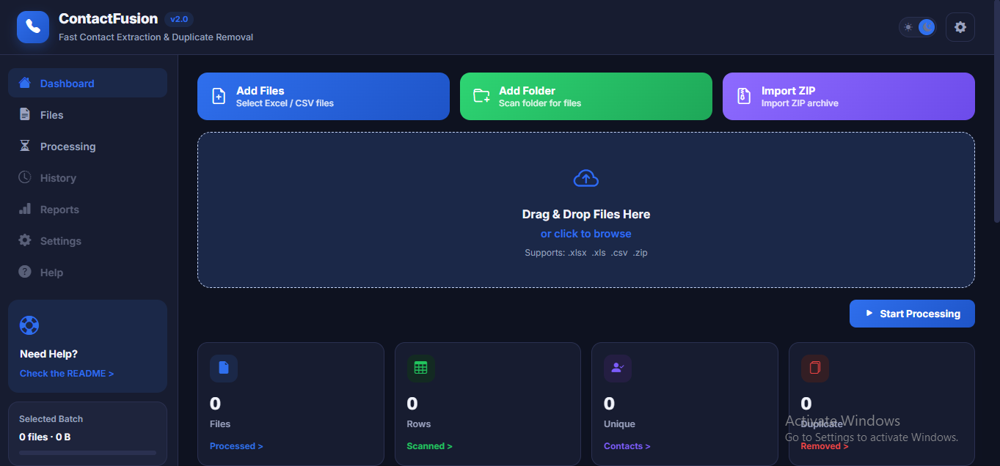
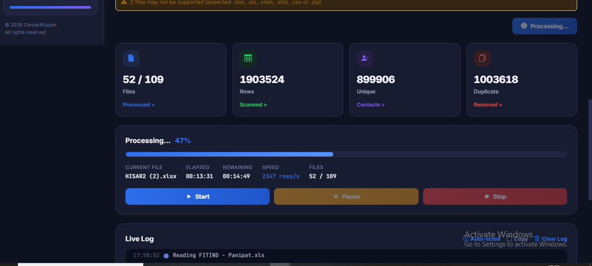

# ContactFusion

<p align="center">
  <h3 align="center">Smart Contact Consolidation Platform</h3>
  <p align="center">
    Merge • Clean • Deduplicate • Export
  </p>
</p>

---

## 📖 Overview

ContactFusion is a high-performance web application built with **FastAPI** that consolidates contact data from multiple Excel and CSV files into a single, clean dataset.

Designed for businesses handling large customer databases, ContactFusion automatically merges files, maps columns, removes duplicate contacts, and exports a ready-to-use Excel file.

---

## ✨ Features

- 📂 Upload multiple Excel & CSV files
- 📁 Folder-based processing
- 📊 Supports XLSX, XLS, CSV & XLSB
- 🔍 Automatic column detection
- 📱 Remove duplicate mobile numbers
- ⚡ High-speed processing
- 📈 Live progress tracking
- 📥 Excel export
- 📱 Mobile-friendly interface
- 🌐 Browser-based application
- 💾 Clean & organized output

---

## 🖼️ Screenshots

## Home Page



### Processing

## Processing



### Download

> Add screenshot here

```
screenshots/download.png
```

---

## 🏗 Project Structure

```
ContactFusion
│
├── app/
│   ├── main.py
│   └── websocket.py
│
├── core/
│   ├── consolidator.py
│   ├── processor.py
│   ├── progress.py
│
├── static/
│   ├── style.css
│   └── script.js
│
├── templates/
│   └── index.html
│
├── uploads/
├── output/
├── logs/
│
├── requirements.txt
└── README.md
```

---

## 🚀 Installation

### Clone Repository

```bash
git clone https://github.com/kumarshiv7686-droid/ContactFusion.git

cd ContactFusion
```

### Create Virtual Environment

```bash
python -m venv venv
```

### Activate Environment

#### Windows

```bash
venv\Scripts\activate
```

#### Linux / macOS

```bash
source venv/bin/activate
```

### Install Dependencies

```bash
pip install -r requirements.txt
```

---

## ▶️ Run the Application

```bash
python -m uvicorn app.main:app --reload
```

or

```bash
uvicorn app.main:app --reload
```

Application will start at

```
http://127.0.0.1:8000
```

---

## 📱 Run on Mobile

Start the server using

```bash
python -m uvicorn app.main:app --host 0.0.0.0 --port 8000
```

Find your local IP

```bash
ipconfig
```

Open

```
http://YOUR_LOCAL_IP:8000
```

on any phone connected to the same Wi-Fi.

---

## ⚙️ Technologies Used

- Python
- FastAPI
- Uvicorn
- Pandas
- OpenPyXL
- DuckDB
- HTML5
- CSS3
- JavaScript

---

## 💼 Use Cases

- CRM Data Consolidation
- Marketing Contact Lists
- Sales Database Cleaning
- Telecalling Database Management
- Lead Consolidation
- Customer Database Deduplication
- Excel Data Processing

---

## 📌 Roadmap

- [ ] Drag & Drop Upload
- [ ] Dark Mode
- [ ] Dashboard Analytics
- [ ] PDF Export
- [ ] User Authentication
- [ ] Cloud Storage Support
- [ ] API Integration
- [ ] Bulk ZIP Processing
- [ ] Progressive Web App (PWA)

---

## 🤝 Contributing

Contributions are welcome.

1. Fork the repository
2. Create a new branch

```
git checkout -b feature-name
```

3. Commit changes

```
git commit -m "Add new feature"
```

4. Push

```
git push origin feature-name
```

5. Create a Pull Request

---

## 📄 License

This project is licensed under the MIT License.

---

## 👨‍💻 Author

**Shiv Kumar**

GitHub:
https://github.com/kumarshiv7686-droid

---

## ⭐ Support

If you found this project helpful, please consider giving it a ⭐ on GitHub.

It helps others discover the project and motivates further development.

---

<p align="center">
Made with ❤️ using FastAPI
</p>
